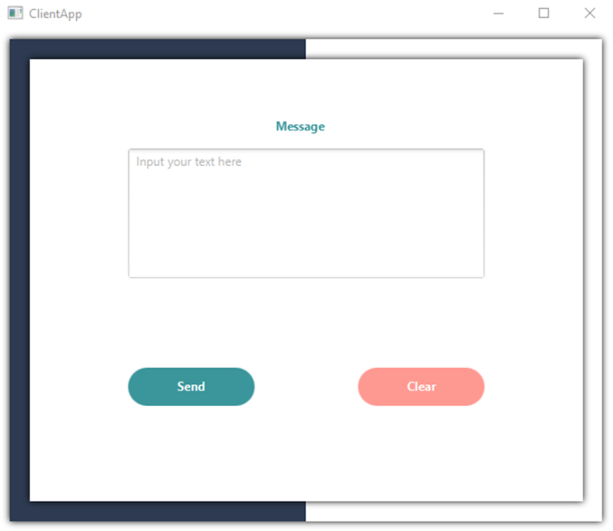

# RSA Digital Signature program with client and server sides

A system that sends encrypted messages one-way from client to server, allows server to check validity of the message.

## Structure
### 1. Server-side    
    Program waits for connection.
    On connection receives client's public key.
    When client sends message, gets the signature and message.
    Allows to check the message validity: true if message was unchanged, false if it was changed.
    
### 2. Client-side

    Connects to the server.
    User can send message to the server.
    
